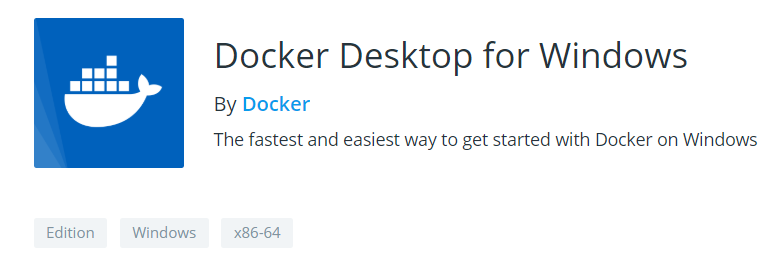

Docker Informationen

Übersicht:

Bild und weitere Infos von [entwickler.de](https://entwickler.de/online/windowsdeveloper/docker-grundlagen-dotnet-container-579859289.html)

- Docker Engine muss installiert sein (Community Edition/Docker Desktop!?)
- Nach der Installation ist Docker auf der Kommandozeile verfügbar: "`docker version`" müsste dann die installierte Version anzeigen.
- Dannach muss Windows neu gestartet werden.

Die Windows Version hat ca. 1GB und kann hier heruntergeladen werden:
[https://hub.docker.com/editions/community/docker-ce-desktop-windows/](https://hub.docker.com/editions/community/docker-ce-desktop-windows/)

Nach der Installation muss Windows neu gestartet werden und dann muss man sich bei Docker anmelden:

