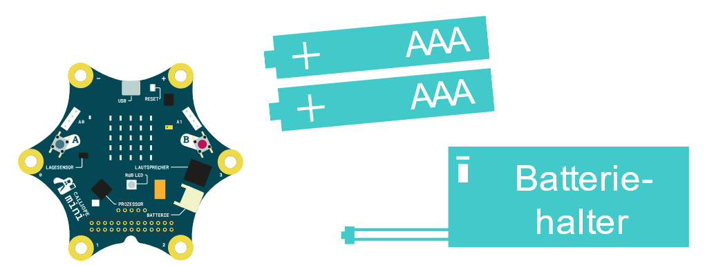

Für den ersten Start des Calliopes benötigst du folgende Sachen:

1. Lege die Batterien in den Batteriehalter und schließe diesen dann an den Calliope mini an.

2. Auf dem Calliope mini sind bereits 4 Programme vorinstalliert. Drücke die Knöpfe A + B zusammen
um ins Auswahlmenü zu kommen. Die Programme werden mit den Zahlen 1 – 4 dargestellt, um eines auszuwählen schüttle den Calliope.

3. Die 4 Programme sind: „mini-Orakel“, „Stein Papier Schere“, „Liebesbarometer“ und „Snake“. Kannst du herausfinden wie man die Spiele steuert?
