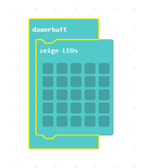

Nun wollen wir ein Bild auf dem Calliope zeichnen. Dieses Bild wird auf der LED-Matrix dargestellt.

1. Verbinde den Calliope mit dem USB-Kabel an deinen Computer:

2. Öffne den online Editor [MakeCode](https://makecode.calliope.cc/beta) und erstelle ein neues Projekt.

3. Im Editor suche unter "Grundlagen" den Block "Zeige LEDs" und ziehe diesen in die "dauerhaft-Schleife".

4. Zeichne ein Bild indem du mit der Maus auf die Kästchen drückst.

5. Lade dein Programm auf den angeschlossenen Calliope indem du links unten auf "Herunterladen" drückst und als Speicherort den angeschlossenen Calliope nimmst.
Der Calliope wird wie ein USB Stick im Explorer des Computers angezeigt.

