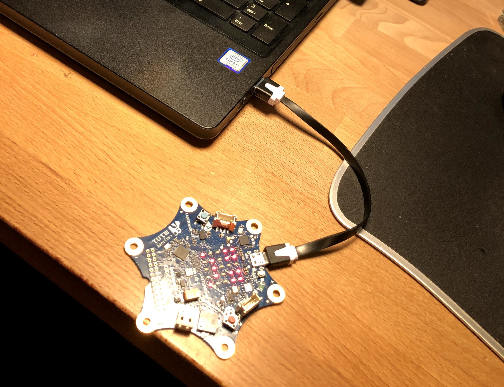
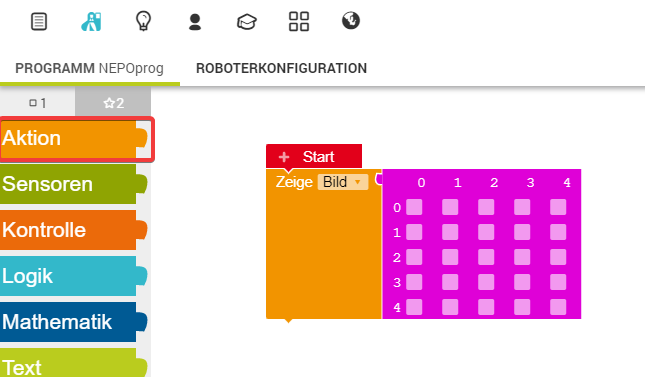
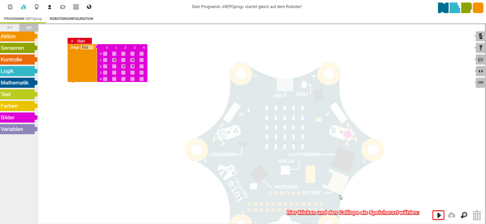

Nun wollen wir ein Bild auf dem Calliope zeichnen. Dieses Bild wird auf der LED-Matrix dargestellt.

1. Verbinde den Calliope mit dem USB-Kabel an deinen Computer:

2. Öffne den online Editor [Open Roberta](https://lab.open-roberta.org/) und wähle Calliope aus.

3. Im Editor suche unter "Aktion" den Block "Zeige Bild" und ziehe diesen unter den "Start-Block".

4. Zeichne ein Bild indem du mit der Maus auf die Kästchen drückst.

5. Lade dein Programm auf den angeschlossenen Calliope indem du rechts unten auf den Pfeil drückst und als Speicherort den angeschlossenen Calliope nimmst:

