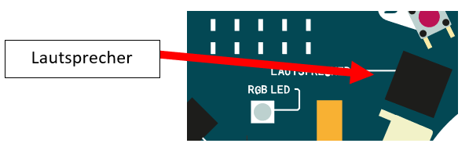
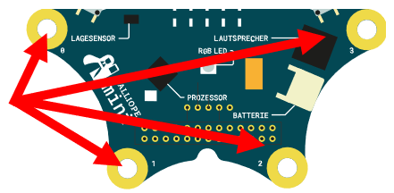

Der Calliope soll mit Hilfe des Lautsprechers verschiedene Töne wiedergeben, je nachdem welche Taste man auf dem Calliope drückt.

1. Nutze den eingebauten Lautsprecher und die Knöpfe A und B des Calliopes.

2. Öffne den [MakeCode Editor](https://makecode.calliope.cc/beta) und schreibe ein Programm, welches Musik spielt, wenn du auf einen der Knöpfe drückst.

3. Wenn du mehr als zwei Tasten nutzen willst, kannst du die Pins 0 – 3 des Calliopes als zusätzliche Eingabemöglichkeiten verwenden. Dazu hält man mit einer Hand den "-Pin" links oben am Calliope und mit der anderen berührt man Pin0-3.

