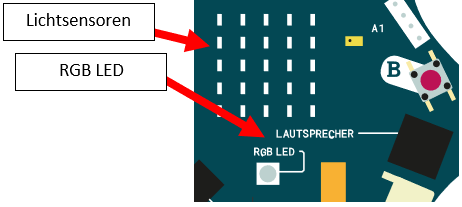

Die RGB LED des Calliopes soll sich automatisch anschalten, wenn es dunkel ist und bei Helligkeit wieder ausschalten.

1. Nutze den eingebauten Lichtsensor des Calliopes.

2. Öffne den [MakeCode Editor](https://makecode.calliope.cc/beta) und schreibe ein Programm, welches das RGB Licht anschaltet, wenn es dunkel ist. Nutze Bedingungen und den Block für den Lichtsensor:

3. Der Helligkeitssensor im Calliope mini ist in das LED-Display integriert. Du kannst damit die Helligkeit 
messen und erhältst Messwerte zwischen 0 und 255. Wenn der Calliope mini 0 anzeigt, ist es ganz 
dunkel, bei 255 sehr hell.