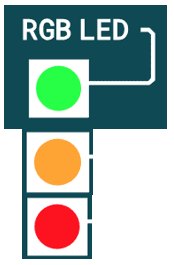

Nutze die RGB (Red Green Blue) LED um eine Ampel nachzubauen!

1. Öffne den [MakeCode Editor](https://makecode.calliope.cc/) und schreibe ein Programm, welches die verschiedenen Farben der Ampel automatisch nacheinander anzeigt. Nutze Anweisungen, die Pause-Funktion und die RGB LED.

2. Kannst du auf der LED Matrix die Zeit, bis zum Umschalten der Ampel, in Sekunden ausgeben?