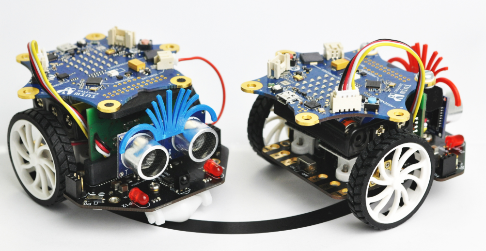
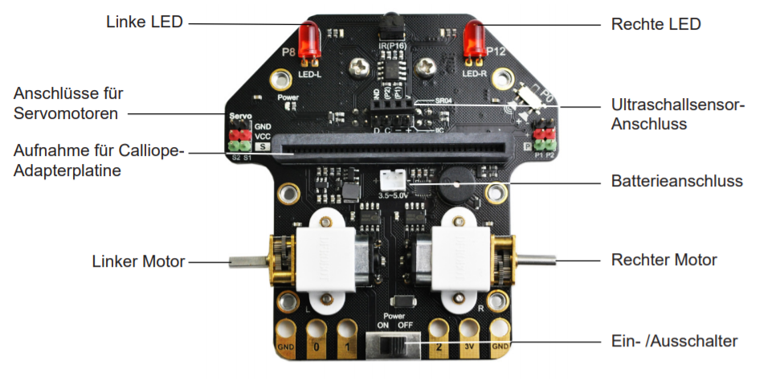
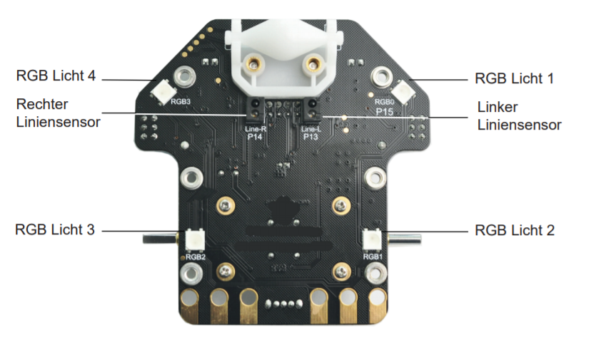

Der Calli:Bot ist eine Robotererweiterung für den Calliope mini.

[Calli:Bot Anleitung als PDF](../../../files/Callibot_Kurzanleitung.pdf)

[Videos mit verschiedenen Möglichkeiten](https://shop.knotech.de/cat/index/sCategory/93)

### Aufbau der Calli:Bot Platine:
Oberseite:

Unterseite:
