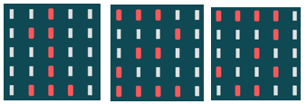
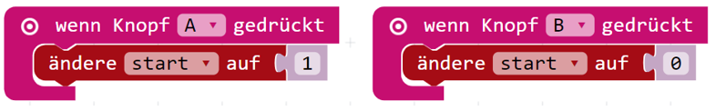

Der Calliope soll als Stoppuhr funktionieren, indem er beim Knopfdruck (A) die Sekunden hochzählt und beim Knopfdruck (B) stoppt.

1. Öffne den [MakeCode Editor](https://makecode.calliope.cc/) und schreibe ein Programm, welches jede Sekunde eine Variable um 1 nach oben zählt, wenn du den Knopf A dürckst. Nutze Schleifen, Bedingungen, Knöpfe und Variablen.

2. Eine weitere Variable kann die Zeit speichern, die in einer Schleife nach oben gezählt wird. Für das richtige Hochzählen der Zeit musst du dein Programm bei jedem Durchlauf für 1 Sekunde pausieren. (1 Sekunde == ? Millisekunden)

3. Füge einen Block ein, der die Variable als Text auf der LED-Matrix des Calliopes ausgibt.

4. Vervollständige den Code, sodass du mit dem Knopf B die Variable wieder auf 0 zurücksetzen kannst.

5. Kannst du das Programm so ändern, dass beim erneuten Knopfdruck A, der Zähler wieder von vorne beginnt?

Du benötigst Hilfe? Dann versuche diesen Code zu vervollständigen: [Calliope als Stoppuhr](https://mini.pxt.io/80409-85613-36197-22012)