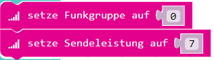

Verwende Funk, um Nachrichten an andere Calliope zu senden und zu empfangen.

1. Öffne den [MakeCode Editor](https://makecode.calliope.cc/) und erstelle ein Programm, welches bei einem Knopfdruck eine Textnachricht auf einem Kanal sendet.
2. Nutze dafür folgende Blöcke, um einen **Kanal** und eine **Sendeleistung** einzustellen:

3. Ein Calliope kann nur einen anderen Calliope über Funk erreichen, wenn beide im gleichen Kanal sind und dauerhaft auf eine Nachricht warten.
4. Füge das Ereignis: Knopfdruck hinzu und sende dann eine Nachricht auf dem vorher gewählten Kanal:

5. Des Weiteren brauchst du einen Block, der überprüft, ob eine Nachricht auf dem Kanal ankommt:

6. Lass die empfangene Nachricht auf der LED Matrix ausgeben.

Kannst du das Programm so erweitern, dass man mehrere verschiedene Nachrichten senden kann?