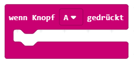

Der Calliope besitzt viele verschiedene Eingabemöglichkeiten, also Ereignisse, auf die der Code dann reagieren kann. Wir starten mit den beiden Knöpfen A+B:

1. Verbinde den Calliope mit dem USB-Kabel an deinen Computer.

2. Öffne den [MakeCode Editor](https://makecode.calliope.cc/beta#editor) und suche in der Kategorie "Eingabe" folgenden Block:

3. Wenn man nun den Knopf A dürckt, wird der Code der sich im Inneren der Klammer befindet ausgeführt.

4. Füge aus der Kategorie "Grundlagen" den Block "zeige Text" in die Klammer des ersten Blocks ein.

5. Erweitere den Code, sodass der Knopf B gedrückt werden kann und dann ein anderer Text auf dem Calliope erscheint.

6. Lade den Code auf deinen am Computer angeschlossenen Calliope herunter und teste diesen.