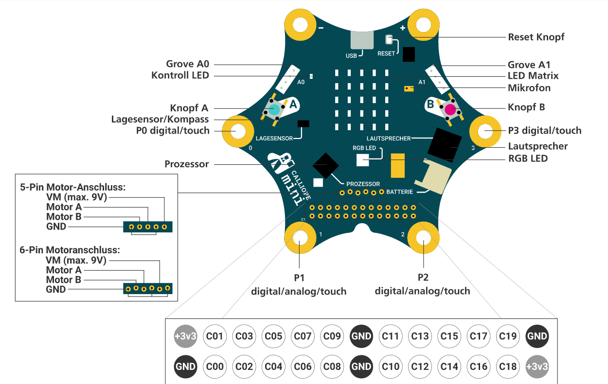

### Aufgaben: 
[Calliope Aufgaben](./01aufgaben)

### Links:
- [Schülerheft 1 von Cornelsen](../../files/cornelsen-schuelermaterial-1.pdf)
- [Schülerheft 2 von Cornelsen](../../files/cornelsen-schuelermaterial-2.pdf)
- [Open Roberta - Editor zum Programmieren](https://lab.open-roberta.org/)
- [Calli:Bot - Roboter für den Calliope](./01callibot)

Der Calliope ist ein Mikrocontroller, der mit einer visuellen Programmiersprachen programmiert werden kann und schon in der Grundschule eingesetzt wird. Dennoch bietet dieser sehr viele Anwendungsmöglichkeiten, die auch in höheren Jahrgangsstufen nutzbar sind.
### Aufbau eines Calliopes:

Der Calliope kann, wenn er an einem Computer angeschlossen ist, mit OpenRoberta programmiert werden:

[Open Roberta](https://lab.open-roberta.org/)

### Roboter für Calliope -> der Calli:Bot
[Informationen zum Calli:Bot](./01callibot)