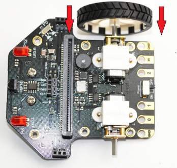
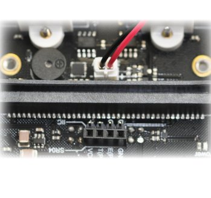
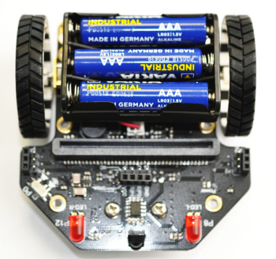
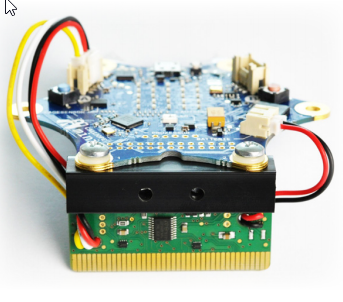
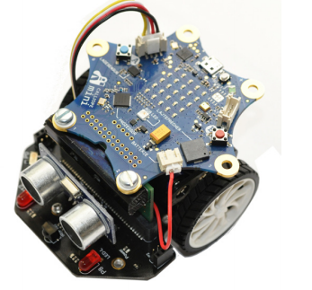

Der Calli:Bot wird folgendermaßen zusammengebaut:

1. Räder anstecken

2. Klebeband an den Batteriehalter ankleben

3. Batteriekabel vorsichtig anstecken

4. Batterien einlegen und Batteriehalter befestigen

5. Callipe an die Adapterplatine schrauben und beiden Stecker einstecken - du benötigst einen Schraubendreher!

6. Adapterplatine einstecken

Optional kannst du noch den Ultraschallsensor, die Augen des Calli:Bots, einstecken.

Nun hast du den Calli:bot zusammengebaut und kannst den Calliope mit Code bespielen, sodass der Roboter auch etwas macht.