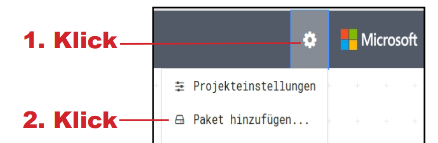
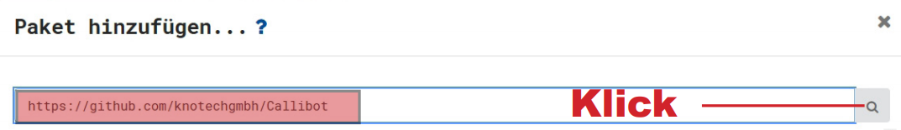

Um die einzelnen Bauteile des Calli:Bots im MakeCode Editor anzusteuern, muss man ein Codepaket in den Editor laden. Das musst du meistens nur einmal am Computer machen, danach steht es dauerhaft im Editor zur Verfügung.

1. Drücke im [MakeCode Editor](https://makecode.calliope.cc/) rechts oben auf das Zahnrad und wähle "Paket hinzufügen" aus. Trage folgende Zeile in das erscheinende Textfeld ein: `https://github.com/knotechgmbh/Callibot` und aktiviere das Paket:

2. Danach siehst du im Editor eine neue Kategorie "Calli:bot" mit verschiedenen Blöcken.

