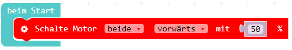
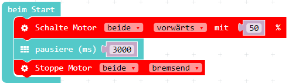

Die Calli:Bot Kategorie wurde nun im [MakeCode Editor](https://makecode.calliope.cc/) eingefügt und die neuen Blöcke können genutzt werden.

1. Schließe den Calliope, der auf dem Calli:Bot sitzt mit Hilfe des USB-Kabels an den Computer an, um im Anschluss dein Programm darauf zu laden.

2. Nun wollen wir den Roboter fahren lassen. Dazu nutzt du den Block "Schalte Motor `beide` `vorwärts` mit `50%`". Dieser Block schaltet beide Motoren an.

3. Der Motor würde nun für immer laufen. Man muss die Motoren auch wieder ausschalten. Dazu lassen wir das Programm z.B. 3 Sekunden pausieren und schalten danach die Motoren wieder aus:

4. Teste verschiedene Geschwindigkeiten und Zeitintervalle.