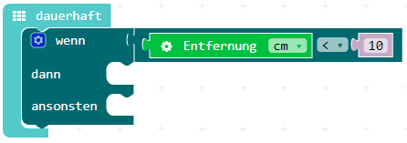

Der Calli:Bot kann nun vorwärts und eine Kruve fahren. Wenn wir jedoch nicht aufpassen fährt der Roboter einfach gegen die Wand und baut einen Unfall. Die Augen des Calli:Bots sind eigentlich ein Ultraschallsensor, der eine Entfernung messen kann. Dieser Ultraschallsensor soll den Callibot abbremsen, wenn er in die Nähe eines Hindernisses fährt:

1. Öffne den [MakeCode Editor](https://makecode.calliope.cc/) und erstelle ein Programm, welches immer die Entfernung / den Abstand nach vorne misst. Wenn die Entfernung zu klein wird z.B. < 10cm, soll der Calli:Bot bremsen.

2. Nutze eine Bedingung mit Alternative. Die Entferung kannst du in der Bedingung folgendermaßen testen:

3. Teste verschiedene Geschwindigkeiten und Entfernungen. Schau ob ein Calli:Bot auch einen anderen Calli:Bot erkennt.
