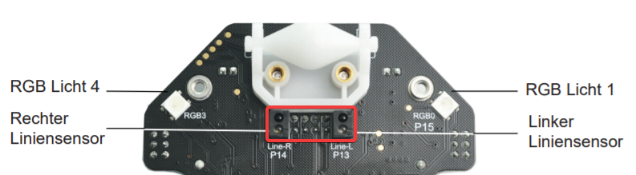
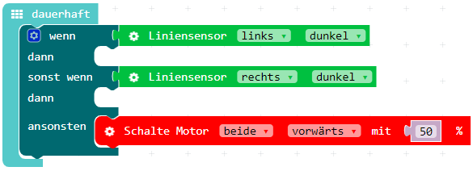

Der Calli:Bot kann fahren und erkennt, ob ein Hindernis vor ihm ist. Nun wollen wir mit Hilfe der Liniensensoren auf der Unterseite, den Calli:Bot einer schwarzen Linie folgen lassen.

1. Die Liniensensoren testen, ob sie unter sich etwas dunkles oder etwas helles sehen. Die Logik wäre, dass wenn der linke Liniensensor etwas dunkles sieht (=schwarze Linie), soll er den linken Motor kurz stoppen, sodass er nicht über die Linie fährt und sich diese immer genau in der Mitte des Calli:Bots befindet. Der rechte Sensor soll mit dem rechten Motor genauso verfahren.

2. Öffne den [MakeCode Editor](https://makecode.calliope.cc/) und nutze eine Bedingung mit Alternative, die testet, ob die Lichtsensoren etwas dunkles unter sich wahrnehmen:

3. Kannst du das Programm vervollständigen, sodass der linke Motor kurz stoppt, wenn der linke Liniensensor etwas dunkles sieht und dass der rechte Motor kurz stoppt, wenn der rechte Liniensensor etwas dunkles sieht?