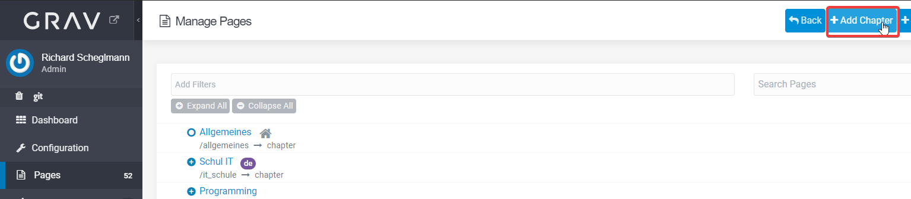
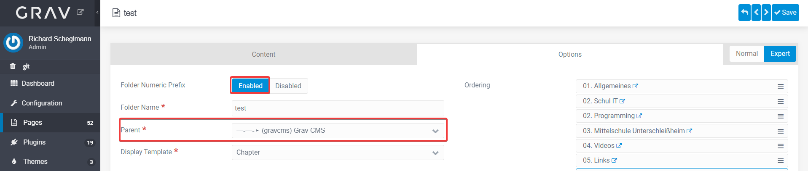
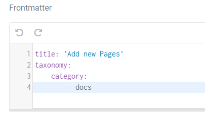

Das Grav Learn 2 Theme kategorisiert die Seiten in der Navigation automatisch. Um eine neue Seite hinzuzufügen muss man im Adminbereich unter Pages ein neues "Chapter" oder eine neue "Documentation Page" hinzufügen:

Im neu erscheinenden Fenster muss "Folder Numeric Prefix" eingeschaltet sein. Dann kann man noch einen übergeordneten Bereich wählen:

Klickt man nun auf speichern, so wird die Seite in der Navigation links angezeigt.

>>>> Achtung: Wenn man die Seitenkategorie (Chapter, Documentation) nachträglich verändert, muss unter "Frontmatter" die Kategorie angepasst werden, sodass die Grav Learn2 Navigation funktioniert. Das Feld "Frontmatter" erscheint erst, wenn man den Expertenmodus eingeschaltet hat.

