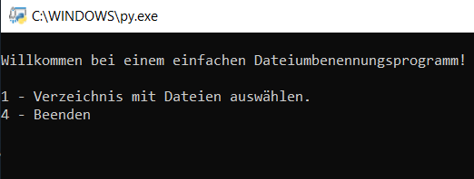

Dieses Python Programm benennt Dateien in einem vorher gewählten Ordner um.
[RenameFilesV1.py](./RenameFilesV1.py)
### Benutzung:

1. Python Datei herunterladen z.B. auf den Desktop
2. Datei per Doppelklick ausführen, dann erschein ein Konsolenfenster:

3. Mit Hilfe von Nummerneingaben kann das Programm gesteuert werden.
4. Zuerst wählt man mit "1" ein Verzeichnis aus, in dem sich die Dateien befinden, die umbenannt werden sollen.
5. Nun wählt man mit "2" aus, dass alle Dateinamen in eine Textdatei geschrieben werden sollen: "Dateinamen.txt"
6. Diese Textdatei kann man nun auch händisch verändern. Die Dateinamen werden mit dem Delimiter "|" getrennt, wobei links der aktuelle Dateiname steht und rechts der Dateiname, den die Datei bekommen soll.
7. Zum Schluss wählt man "3" und bekommt nochmal eine Zusammenfassung angezeigt, welche Dateien wie umbenannt werden sollen. Wenn man dann in der Konsole "ja" eingibt werden die Dateien umbenannt.

```python
#Bibliotheken werden importiert
from os import listdir, rename, path
import csv, sys
from tkinter import Tk
from tkinter.filedialog import askopenfilename, askdirectory

#Globale Variablen, auf die von überall zugegriffen werden kann
PfadZuDateien = ''
meineDateienGefiltert = []

#Hier kann man Dateiendungen oder ganze Dateinamen eintragen die ignoriert werden sollen
DateiendungenIgnorieren = ('.pdf') #leer -> ()
DateinamenIgnorieren = ('Dateinamen.txt') #leer -> ()

#Funktionen:
#F1: Entfernt alle Ordner aus der Liste der Dateien
def filterDateien():
    meineDateien = listdir(PfadZuDateien)
    for datei in meineDateien:
        if not path.isdir(path.join(PfadZuDateien, datei)):
            global meineDateienGefiltert
            meineDateienGefiltert.append(datei)

#F2: Schreibt die Dateinamen in eine Textdatei, die dann benutzt wird um die eigentlichen Dateien umzubenennen
def writeFileNamesToTxt(files):
    with open(PfadZuDateien + 'Dateinamen.txt', 'w+', newline='') as names_file:
        name_writer = csv.writer(names_file, delimiter='|')
        print('Option auswählen:\n1 - Dateiname| \n2 - Dateiname| Dateiname\n3 - fortlaufend mit Präfix: Name_01-99\n4 - fortlaufend mit Suffix: 01-99_Name\n5 - mit Textdatei')
        eingabe = input()
        if eingabe == '3':
            print('Prefix eingeben: z.B. "Datei_"')
            eingabePrefix = input()
        elif eingabe == '5':
            Tk().withdraw()
            externFilename = askopenfilename()
            externAlllines = open(externFilename).read().splitlines()
        elif eingabe == '4':
            print('Suffix eingeben: z.B. "_Datei"')
            eingabeSuffix = input()
        counter = 1
        for fileName in files:
            if not fileName.endswith(DateiendungenIgnorieren) and fileName not in DateinamenIgnorieren:
                if eingabe == '1':
                    name_writer.writerow([fileName,''])
                    print(fileName + '|')
                elif eingabe == '2':
                    name_writer.writerow([fileName,fileName])
                    print(fileName + '|' + fileName)
                elif eingabe == '3':                    
                    extension = fileName.split('.')
                    name_writer.writerow([fileName,eingabePrefix + str("{0:0=2d}".format(counter)) + '.' + extension[-1] ])
                    print(fileName + '|' + eingabePrefix + str("{0:0=2d}".format(counter)) + '.' + extension[-1])
                    counter += 1
                elif eingabe == '4':                    
                    extension = fileName.split('.')
                    name_writer.writerow([fileName,str("{0:0=2d}".format(counter)) + eingabeSuffix + '.' + extension[-1] ])
                    print(fileName + '|' + str("{0:0=2d}".format(counter)) + eingabeSuffix + '.' + extension[-1])
                    counter += 1
                elif eingabe == '5':
                    extension = fileName.split('.')
                    if counter-1 < len(externAlllines) and externAlllines[counter-1] != '':
                        name_writer.writerow([fileName, externAlllines[counter-1]+ '.' + extension[-1]])
                        print(fileName + '|' + externAlllines[counter-1]+ '.' + extension[-1])
                    else:
                        name_writer.writerow([fileName,''])
                        print(fileName + '|')
                    counter += 1
        print('\n-> Dateinamen in "Dateinamen.txt" geschrieben.')
    start()

#F3: Benennt die Dateien anhand der Namen in der Textdatei um
def renameFilesAsInTextfile(type):
    with open(PfadZuDateien + 'Dateinamen.txt') as names_file:
        csv_reader = csv.reader(names_file, delimiter='|')
        if type == 0:
            for row in csv_reader:
                if f'{row[1]}' == '':
                    print(f'{row[0]}' + ' -> ' + 'keine Änderung!')                    
                else:
                    print(f'{row[0]}' + ' -> ' + f'{row[1]}')
        else:
            for row in csv_reader:
                if f'{row[1]}' != '':
                    rename(PfadZuDateien + f'{row[0]}', PfadZuDateien + f'{row[1]}')
                    print('Datei: ' + f'{row[0]}' + ' wurde zu ' + f'{row[1]}' + ' umbenannt.')

#F4: Start
def start():
    global PfadZuDateien
    #Auswahlmenü:
    print('\nWillkommen bei einem einfachen Dateiumbenennungsprogramm!')
    print('\n1 - Verzeichnis mit Dateien auswählen.')
    if PfadZuDateien != '':
        print('2 - Dateinamen in die Datei "Dateinamen.txt" schreiben.')
        print('3 - Dateien nach "Dateinamen.txt" umbenennen?')
    print('4 - Beenden')
    eingabe = input()

    #check user input:
    if eingabe == '1':
        Tk().withdraw()
        PfadZuDateien = askdirectory()
        PfadZuDateien += '/'
        filterDateien()
        print('Ausgewählter Pfad: ' + PfadZuDateien)
        start()
    elif eingabe == '2':
        writeFileNamesToTxt(meineDateienGefiltert)
    elif eingabe == '3':
        renameFilesAsInTextfile(0)
        print('\nWollen Sie folgende Umbenennung durchführen? \nja - nein')
        bestaetigen = input()
        if bestaetigen == 'ja':
            renameFilesAsInTextfile(1)
    elif eingabe == '4':
        sys.exit()

start()

#end:
input("\nDrücke ENTER um das Programm zu beenden...")
```