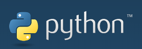
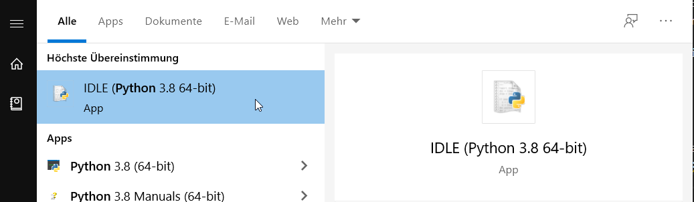

### Programme:
[Dateien im Ordner umbenennen](./01)



Python ist eine einfache und dennoch sehr starke Programmiersprache, die versucht, einen gut lesbaren Programmcode zu fördern. Oft wird Python als erste textbasierte Programmiersprache in der Schule eingeführt.

Python Code soll leicht lesbar sein. Was könnte dieser Code machen?
```python
print("Hallo, wie geht es dir?")
```
-> diese Anweisung gibt am Bildschirm einfach den Text in den Klammern aus, also "Hallo, wie geht es dir?".

Um Pyhton Code zu schreiben und auszuführen hat man zwei Möglichkeiten:

1. man kann einen online Editor nutzen um Python Code zu schreiben und auszuführen: [Python online Editor](https://www.programiz.com/python-programming/online-compiler/)
2. man muss Python für den Computer herunterladen: [Python.org](https://www.python.org/downloads/) und installieren. Danach kann man mit Hilfe der Python IDLE Code schreiben und ausführen:
