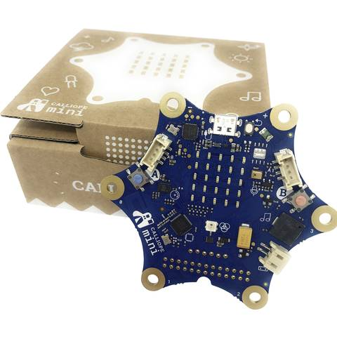

### Programmierung
In diesem Themenbereich dreht sich alles um die Programmierung. Es wird ein Fokus auf Programmiersprachen gelegt, die in der Schule - Mittelschule benutzt werden können.

Folgende Unterthemen sind gerade verfügbar:

### Scratch

Scratch ist eine visuelle Programmiersprache, die in der ersten Version 2007 veröffentlicht wurde, und jetzt gerade in der 3. Version verfügbar ist.

Das tolle daran ist, dass man den Scratch-Editor online unter: [https://scratch.mit.edu/](https://scratch.mit.edu/) oder auch offline direkt auf dem Computer nutzen kann.

Im Scratch-Bereich kann man verschiedene Aufgaben finden, die Schritt für Schritt an die Programmierung in Scratch heranführen.

Des Weiteren gibt es vorgefertigte "Studios" die z.B. ein halbfertiges Programm vorgeben, welches die Schüler*innen vervollständigen müssen.

### Calliope

Der Calliope ist ein Mikrocontroller, der mit einer visuellen Programmiersprachen programmiert werden kann und schon in der Grundschule eingesetzt wird. Die Programmierumgebung ähnelt Scratch. Dennoch bietet dieser sehr viele Anwendungsmöglichkeiten, die auch in höheren Jahrgangsstufen nutzbar sind.

