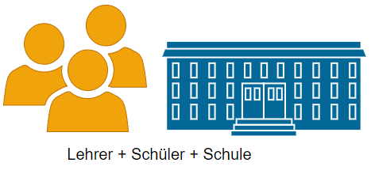
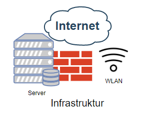
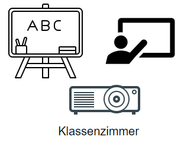
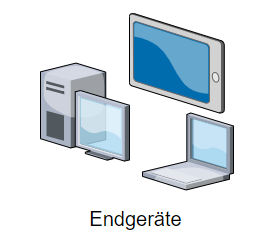
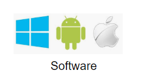
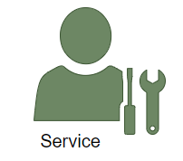
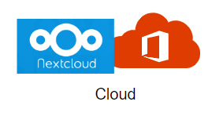

[<- zurück](../../it_schule/01)
# IT an Schulen

### Übersicht einzelner Teilbereiche
1. Hello
2. ho
3. super

---
[.build-lists: true]
# Infrastruktur
1. Hello
2. ho
3. super

---
# Klassenzimmer

---
# Endgeräte

---
# Software

---
# Service und Wartung

---
# Cloud
