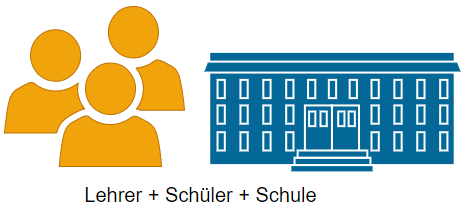
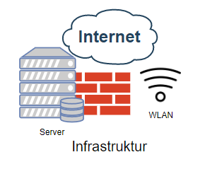
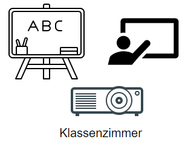
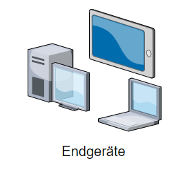
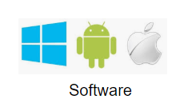
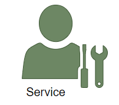
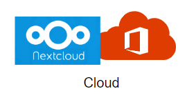

[.background-color: #fff]
[<-- zurück](../../it_schule/01)
# IT an Schulen

### Übersicht einzelner Teilbereiche

---
# Infrastruktur

---
# Klassenzimmer

---
# Endgeräte

---
# Software

---
# Service und Wartung

---
# Cloud
